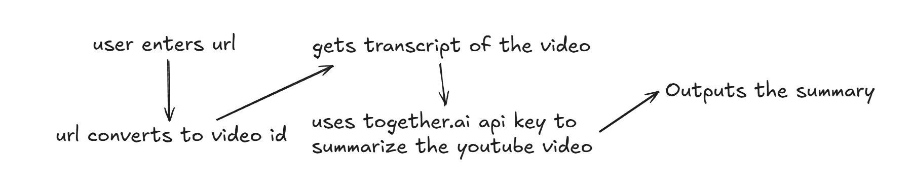

# AI Prompt Assistant with Together API

This script is a simple CLI-based tool that leverages the together.ai API to interact with a LLM (`Llama-3.3-70B`). It streamlines the process of querying AI, especially useful for tasks like summarizing YouTube video transcripts — no need to bounce between services anymore.

---
## 🧠 Why This Exists

Most tools (like Gemini) choke when it comes to summarizing long YouTube videos. The usual workaround involved:
1. Generating a transcript.
2. Feeding it manually to a different AI model.
3. Asking for summaries.
This script kills that pain. One step, one model, fast output.

---
## 🖼️ Visual Explanation


---
## 🔧 Requirements

- Python 3.7+
- `together` Python package
- A together.ai API key set in your environment

---
## 📦 Installation

1. Install python 3.7+.

2. Download or clone this repository:
   ```bash
   git clone https://github.com/prshv1/Youtube-Summarizer

3. Install dependencies
    ```bash
    pip install -r list_dependencies.txt

4. Run this program in a powershell, or a IDE like VS code. 

---
## 📱 Follow & Support

- 📸 [Follow me on Instagram](https://www.instagram.com/parshva.0/)
- 💸 UPI ID for donations: `parshvagala@fam`

